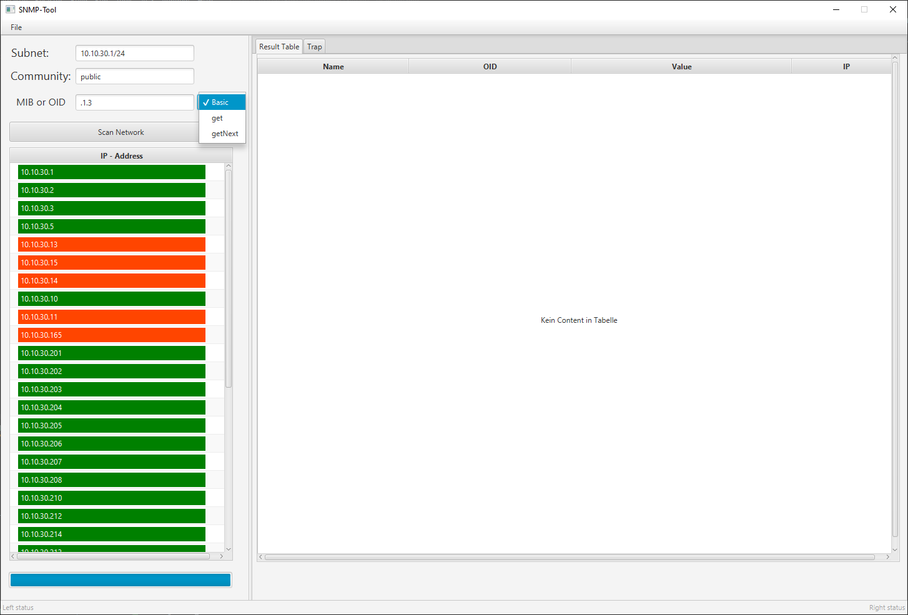
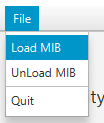
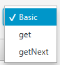
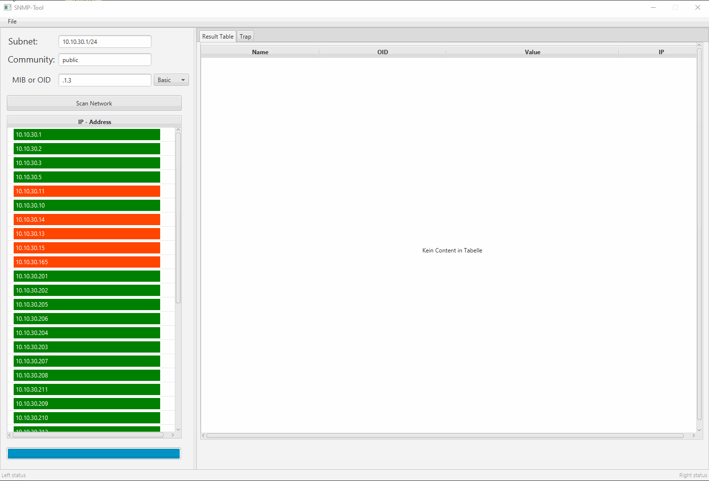
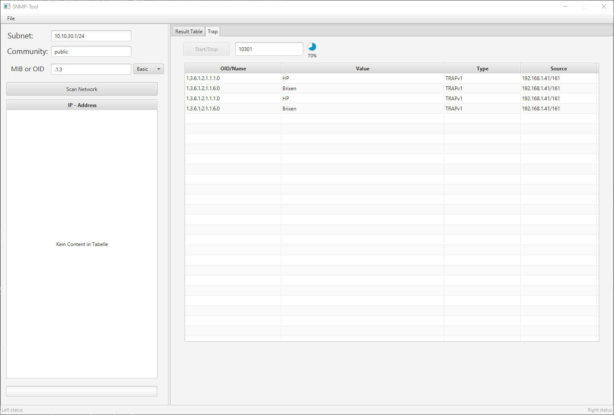
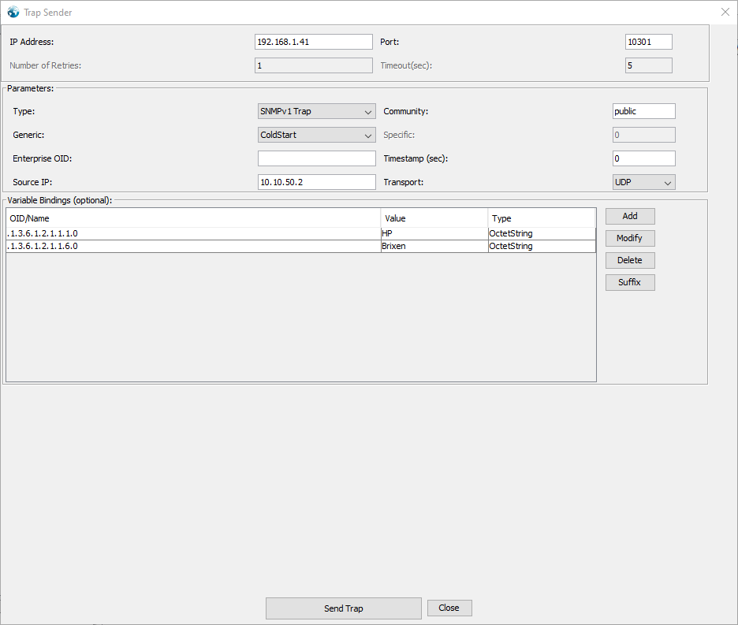

# Cikalleshi_SNMP
Systeme und Netze: SNMP-Tool programmieren

## Prerequisites
* Java 14 oder höher muss installiert sein. Zusätzlich muss man auch [JavaFX](https://gluonhq.com/download/javafx-15-0-1-sdk-windows/) 14 oder 15 herunterladen.   
* Das Programm braucht die Library von [tnm4j](https://github.com/soulwing/tnm4j).   
* Es ist jedoch empfehlenswert Maven zu verwenden.

```
    <dependencies>
        <!-- https://mvnrepository.com/artifact/org.soulwing.snmp/tnm4j -->
        <dependency>
            <groupId>org.soulwing.snmp</groupId>
            <artifactId>tnm4j</artifactId>
            <version>1.0.11</version>
        </dependency>
    </dependencies>
```

## Installing

In die Releases kann man die [SNMP.jar](https://github.com/ErikCikalleshi/Cikalleshi_SNMP/releases/download/Final/SNMP-1.0-SNAPSHOT-jar-with-dependencies.jar)-Datei herunterladen.

## Running the Program

Die jar-Datei sollte mit dem folgenden Befehl ausgeführt werden:

```
java --module-path {PATH_TO_FX_NUMBER/lib} --add-modules javafx.controls,javafx.fxml,javafx.base,javafx.graphics,javafx.web,javafx.swing -jar {PATH_TO_JAR}
```
**Reminder: JavaFx 15 und JDK 14 muss installiert sein**

Um nachzuschauen, welche Version man auf dem Rechner installiert hat, führen Sie folgenden Befehl aus:
```
java -version
```
## How to use

Man muss nur das gewünschte Subnet und die Community eingeben. Die `Methode` ist standardmäsßig auf `Basic` eingestellt.



### Features

#### Input


#### Load Own Files



#### Method



#### Mibs or Oids




## Trap Listener

Um den Listener zu starten müssen sie auf `Start/Stop` klicken und den gewünschten Port eingeben.


Leider auf Windows sind Traps schwerer weiterzuleiten, als in Linux. Aber glücklicherweise kann man mit den Tool von [iReasoning](https://www.ireasoning.com/) Traps weiterleiten. 

### Send Trap

Unter `Tools` kann man den `Trap Sender` finden.


